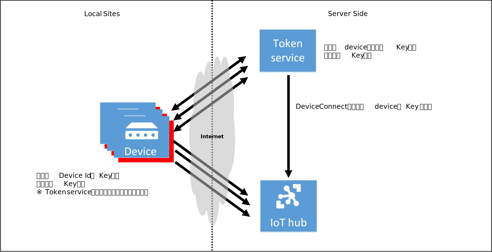
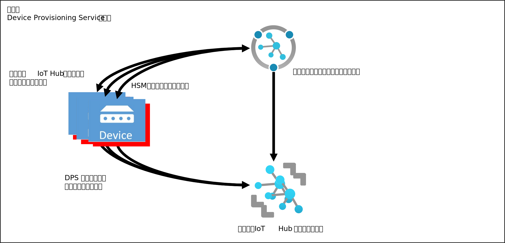
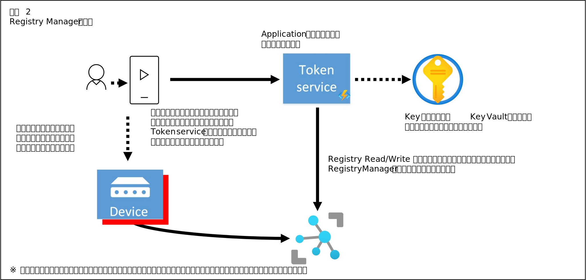

# Azure IoT Hub デバイス接続方法 サンプル
前提知識 : https://docs.microsoft.com/ja-jp/azure/iot-hub/  

本サンプルでは、Azure IoT Hub の Device Repository に登録された Device Id に割り当てられた機器を Shared Access Key で接続する際のかなりマニアックな補足情報を解説する。  
ソリューション運用中に障害が発生した場合に問題特定が難しいと思われる [Azure IoT Device SDK for Node.js](https://github.com/Azure/azure-iot-sdk-node) を使って解説する。  

※ Azure IoT Device SDK は、Node.js の他に、C言語、C#、Python、Java 向けのライブラリが公開されている。その中で、細かい設定が一番豊富で、実行に必要なHWリソースが一番小さくて、かつ、接続状態等に関して一番多くの情報を出力でき、移植性が最も高いのがC言語向けのSDKである。ビジネス用途の IoT ソリューションを開発する場合、ソリューションの特性に応じて、適切な言語向けの SDK を選択する事が重要である。（間違っても、単に、開発チームがその言語しか使えないからというような理由での選択はNG）  

Azure IoT Device SDK を使って機器を IoT Hub に接続する機器上で動作するアプリケーションを、以後、"<b>Device App</b>"と記す。  
Device App で接続するチュートリアルは、https://docs.microsoft.com/ja-jp/azure/iot-develop/quickstart-send-telemetry-iot-hub?toc=%2Fazure%2Fiot-hub%2Ftoc.json&bc=%2Fazure%2Fiot-hub%2Fbreadcrumb%2Ftoc.json&pivots=programming-language-nodejs で紹介されているので、先ずは、熟読し、Node.jsは、Windows PC でも Mac でも Linux でも動くので、とりあえずは実際に動かして試してみていただきたい。  
ここで紹介されているのは、
```
HostName=<IoT Hub のエンドポイント>;DeviceId=<接続したい Device Id>;SharedAccessKey=<接続したい Device Id の Shared Access Key>
```
という形式の接続文字列を使って、Node.jsのプログラム内で、
```javascript
const Protocol = require('azure-iot-device-mqtt').Mqtt;
const Client = require('azure-iot-device').Client;

var iothubEndpoint = '...';
var deviceId = '...';
var deviceIdSASKey = '...';
var connectionString = 'HostName=' + iothubEndpoint + ';DeviceId=' + deviceId + ';SharedAccessKey=' + deviceIdSASKey;

var client = Client.fromConnectionString(connectionString, Protocol);
client.open(function(){
    ...
});
```
こんな基本的な流れで接続するという実に簡単な処理で、IoT Hub への接続、Device to Cloud メッセージを送信するというものである。この接続方法で、Cloud to Device メッセージの受信、Direct Method Invocation、Device Twin によるメタデータの送受信が可能である。  
※ ここでは通信プロトコルを MQTT にしているが、特に、MQTT の利用を強制しているものではない。頻繁にクラウドに対してデータを送信する場合は、MQTT、もしくは、AMQP が適しているので適切な方を選択していただきたい。  
※ Azure IoT Hub への接続は、MQTT や AMQP、HTTPS が利用可能であるが、それぞれのプロトコルの処理の違いは、Azure IoT Device SDK のライブラリが全て実行してくれるので、開発者は<b>単に使いたいプロトコルを選択するだけでよい</b>  
※ Device SDK を使うと、アプリケーションロジックのレベルでは、どのプロトコルを使っているか意識する必要はない。ただし、SDK ライブラリの内部実装では、それぞれのプロトコルの特徴に合わせた処理を行っているので、アプリケーション実行中にネットワークの状況や、機器の状態に依存して微妙な振舞の差異が発生する場合がある。  

接続文字列で使っている Shared Access Key は、Device App が、「自分は、あなたに登録されている Device Id としてつなぎますよ」と宣言するための秘密鍵の役割を果たす。そのため、Shared Access Key は第三者に漏らしてはいけないものである。
IoT Hub との通信においては、接続文字列で使っている Shared Access Key をインターネット上の通信でそのまま外部に送信をするようなことはしておらず、  
https://docs.microsoft.com/ja-jp/azure/iot-hub/iot-hub-dev-guide-sas?tabs=node#security-tokens  
で紹介されている有効期限付きの Token を、Device Id、Shared Access Key から作成し、その Token を使って IoT Hub と接続し、期限が切れたら Token を再生成して接続しなおすという処理が必要である。  
読者の中には、この記述を運悪く最初に探し出して、Device App のロジックで自力で Token を生成して接続するコードを書かないといけないという強迫観念に駆られてしまう人もいるかもしれないが、上で紹介した、接続文字列を使った接続の場合は、SDK ライブラリが自動更新してくれるので、それに任せればよい。  
ただし、IoT Hub と Device App の間の接続は、Token の有効切れ以外の様々な理由で切断される可能性はあるので、ビジネスユースの場合は、接続状況の確認、接続が切れた場合の再接続のロジックの実装等は必須である。接続が断たれている期間中は、当然、Device to Cloud メッセージの送信もできないので、送信が失敗した際の再送信機構等も要件に応じて必要になる。  

※ HW リソースに余裕があって、Docker が利用可能なレベルの機器を採用している場合は、[Azure IoT Edge](https://docs.microsoft.com/ja-jp/azure/iot-edge/?view=iotedge-2020-11) の利用を推奨する。Azure IoT Edge であれば、ネットワーク接続が切れている間のメッセージキューイング、再接続時の再送信の機構を備えているので、アプリケーション層での実装は必要なく、とても便利である。  

このように、接続文字列を使って Client.fromConnectionString() で接続すれば特に問題は無いのであるが、何らかの理由（Tokenの有効期間をデフォルトの60分からもっと短くしたいとか？）により、Device App のアプリケーションロジックで、明示的に Token を生成して接続したい場合も、ない事は無いわけでもないかもしれない。  
その場合、Token 作成時に指定した有効期間が過ぎれば、当然、IoT Hub との接続は切断されるので、新しく Token を作成し再接続する処理が必要となる。  
そのような場合のサンプルコードを以下に示す。  
```javascript
var iothubEndpoint = '...';
var deviceId = '...';
var deviceIdSASKey = '...';

const expireMinutes = 10;   // Token の有効期限。単位は分。

// const Protocol = require('azure-iot-device-mqtt').Mqtt;
const Protocol = require('azure-iot-device-amqp').Amqp;     // AMQP プロトコルを利用の場合
const Client = require('azure-iot-device').Client;
var crypto = require('crypto')                              // Token 生成に必要

// Token 生成
function createTokenByDeviceId() {
    var resourceUri = iothubEndpoint + '/devices/' + deviceId ;
    resourceUri = encodeURIComponent(resourceUri);
    var expires = (Date.now() / 1000) + expireMinutes * 60;
    expires = Math.ceil(expires);
    var toSign = resourceUri + '\n' + expires;
    var hmac = crypto.createHmac('sha256', Buffer.from(deviceIdSASKey, 'base64'));
    hmac.update(toSign);
    var base64UriEncoded = encodeURIComponent(hmac.digest('base64'));
    var token = "SharedAccessSignature sr=" + resourceUri + "&sig="
        + base64UriEncoded + "&se=" + expires;
    return token;
}

// IoT Hub に接続してメッセージ送信
function connectAndSend() {
    var endTime = new Date();
    endTime.setMinutes(endTime.getMinutes() + expireMinutes);

    client.on('connection',(stream)=>{
        console.log(stream.toString());
    });
    var Message = require('azure-iot-device').Message;

    let sendInterval;

    // Device to Cloud 送信用メッセージ作成
    function generateMessage () {
        var dt = new Date();
        const windSpeed = 10 + (Math.random() * 4); // range: [10, 14]
        const temperature = 20 + (Math.random() * 10); // range: [20, 30]
        const humidity = 60 + (Math.random() * 20); // range: [60, 80]
        const data = JSON.stringify({ deviceId: 'myFirstDevice', windSpeed: windSpeed, temperature: temperature, humidity: humidity, timestamp: dt.toFormat("YYYY/MM/DD-HH:MI:SS") });
        const message = new Message(data);
        message.properties.add('temperatureAlert', (temperature > 28) ? 'true' : 'false');
        return message;
    }

    var connectCallback = function (err) {
        if (err) {
            console.error('Could not connect: ' + err.message);
        } else {
            console.log('Client connected');
            client.on('error', function (err) {
                console.error(err.message);
                process.exit(-1);
            });

            if (!sendInterval){
                sendInterval = setInterval(()=> {
                    // 有効期限をチェックし、過ぎていたら、ループを終了  
                    // ただし、JavaScript の場合、本コードで、厳密に Token 作成時tの有効期限と、実行時点の整合性がとれるかどうか疑問は残る
                    var send = true;
                    var now = new Date();
                    if (now > endTime) {
                        // client.close();
                        clearInterval(sendInterval);
                        var msg = 'clearInterval';
                        console.log(msg);
                        send = false;
                    }
                    if (send) {
                        var msg = generateMessage();
                        client.sendEvent(msg, function (err) {
                            if (err) {
                                console.error(err.message);
                            } else {
                                console.log('Message sent' + msg.getData());
                            }
                        });
                    }
                }, 2000);
            }
        };
    };

    // 設定された Token で IoT Hub に接続
    client.open(connectCallback);
};

// Token を生成して、IoT Hub への接続設定を行う。
var token = createTokenByDeviceId();
let client = Client.fromSharedAccessSignature(token, Protocol);
console.log('generated token');

// サービス側からの Shared Access Key 更新要求受信用コード  
// サービス側で Device Id の Device Twin Desired Properties を更新すると受信できる  
// このサンプルは、Tokenの再生成とDevice Twin更新受信の競合を考慮していないので注意
client.getTwin(function(err, twin){
    if (err) {
        console.log('could not get twin');
    } else {
        twin.on('properties.desired', function(delta){
            var logMsg = 'desired twin is updated -' + JSON.stringify(delta);
            console.log(logMsg);
            saveIncident(logMsg);
            var policyNameKey = 'policy-name';
            var saskeyKey = 'shared-access-key';
            if (policyNameKey in delta) {
                policyName = delta[policyNameKey];
                policySASKey = delta[saskeyKey]
            }
            if (saskeyKey in delta) {
                deviceIdSASKey = delta[saskeyKey];   
            }
        });
    }
});

// 一回目の接続と送信
connectAndSend();

let connectInterval;

if (!connectInterval) {
    connectInterval = setInterval(()=>{
        // 前回の Token の有効期限が失効しているので、再生成
        var token = createTokenByDeviceId();
        console.log('re-generated token');
        // Client ライブラリに対して、Token を更新
        client.updateSharedAccessSignature(token, (updateSAS)=>{
            if (updateSAS) {
                console.log(updateSAS.message);
            }
            else {
                console.log('updaed token');
                // 新たに接続と送信を開始
                connectAndSend();
            }
        });
    }, 1000 * 60 * expireMinutes);
}
```
※ 筆者は、JavaScript は普段あまり使わないので、色々なお作法には則っていないかもしれない。読者の中で「もっとこうしたらいいよ」という方がいれば、Pull＆Request Welcome！  

接続文字列で接続する場合との差異は以下の通りである。  
- Token での接続の場合は、Client.fromSharedAccessSignature() を使う  
- Token を再生成した場合は、client.updateSharedAccessSignature() を使う  
- 有効期限のチェックと Token の再生成、及び、再接続を繰り返すループ処理が必要  

※ 筆者の実験によれば、有効期限失効後、再度、Client.fromSharedAccessSignature() のコールでも、継続的な接続は可能なようである。まぁ、API として updateSharedAccessSignature() が用意されているので、こちらを使ったほうがいいかなという判断。  

前に、紹介した、  
https://docs.microsoft.com/ja-jp/azure/iot-hub/iot-hub-dev-guide-sas?tabs=node  
をよーく読むと、実は、もう一種類の接続方法が紹介されていることに気づく読者も多いと思うので、そちらも紹介しておく。  
Azure IoT Hub には、それぞれの機器を区別して接続するための Device Id とそれに紐づけられた接続用セキュリティ情報の仕組みの他に、機器が IoT Hub に対して利用可能な以下の機能、  
- Device to Cloud メッセージを送信する  
- Cloud to Device メッセージを受信する  
- Direct Method Invocation を受信し、結果を返す  
- Device Twin Desired Properties を参照、あるいは、更新を受信する  
- Device Twin Reported Properties を更新する  

を実行可能な役割（"Device Connect"と呼ぶ）を持つ、"<b>device</b>"という名前の<b>共有アクセスポリシー</b>がデフォルトで定義されている。ちなみに、このポリシーは削除も可能であり、Device Connect の役割を持つ、ユーザー独自の共有アクセスポリシーを作成することもできる。  
先に説明してきた方法とは別に、この、  
- 共有アクセスポリシー名  
- 共有アクセスポリシーの Shared Access Key  
- IoT Hub に登録された Device Id  

の情報から Token を生成して、IoT Hub に接続する事も可能である。  
その場合の Token の生成コードのサンプルは以下の通り。  
```javascript
var iothubEndpoint = '...' ;  // IoT Hub のエンドポイント URL
var policySASKey = '...'; // Device Connect ロールの Shared Access Key
var deviceId = '...'; // IoT Hub に登録された Device Id
var policyName = 'device';   // Device Connect ロールのポリシー名
const expireMinutes = 10;

function createTokenByDeviceRole() {
    var resourceUri = iothubEndpoint + '/devices/' + deviceId ;
    resourceUri = encodeURIComponent(resourceUri);
    var expires = (Date.now() / 1000) + expireMinutes * 60;
    expires = Math.ceil(expires);
    var toSign = resourceUri + '\n' + expires;
    var hmac = crypto.createHmac('sha256', Buffer.from(policySASKey, 'base64'));
    hmac.update(toSign);
    var base64UriEncoded = encodeURIComponent(hmac.digest('base64'));
    var token = "SharedAccessSignature sr=" + resourceUri + "&sig="
        + base64UriEncoded + "&se=" + expires
        + "&skn="+policyName;
    
        return token;
}
```
Device Id に紐づけられた Shared Access Key は再生成が可能であり、IoT Hub 側で再生成した場合は、古い Shared Access Key を使っている機器は接続ができなくなるにもかかわらず、この方法を使えば、Device Id 側のセキュリティ設定状況に関わらずこの方法で接続できてしまうので、あくまでも筆者の私見ではあるが、何故、こんなロールが用意されているのか理解に苦しむところである。  
また、Device Id に紐づいた Shared Access Key が万一漏れた場合は、その Shared Access Key を再生成して機器側の Shared Access Key を更新すれば済む話ではあるが、Device Connect ロールを持つポリシーに紐づけられた Shared Access Key は一度漏れてしまうと、全ての Device Id が危険にさらされるので、取り扱いはさらに厳重にしなければならないであろう。  
https://docs.microsoft.com/ja-jp/azure/iot-hub/iot-hub-dev-guide-sas?tabs=node#create-a-token-service-to-integrate-existing-devices
には、Device Connect ロールを使うシナリオの一例が紹介されている。しかし、この構成を採用する場合には注意が必要である。device 共有アクセスポリシーの Shared Access Key を使うのは、"Token service" であり、この機能は、サーバー側に配置されるものであろうと推察される。  
サーバー側で Shared Access Key を持つので在れば、現場側に設置される機器に比べて、アクセス制限やそのロジックが実行する際の権限の管理もより厳重な対策が施されると思われる。例えば、Token service のロジックを実行する際に適切な権限で実行する、[Azure Key Vault](https://docs.microsoft.com/ja-jp/azure/key-vault/general/overview)等を用いて、ロジックにハードコードせず、適切な権限で取り出せるようにしておくなどの工夫が最低限必要であろう。  

  

補足情報であるが、IoT Hub の共有アクセスポリシーと Device Registryに登録した Device Id での接続は、機器から IoT Hub に Device to Cloud メッセージを送信した際にメッセージに対して自動的に付与されるシステムプロパティの値が異なる。  
|使用する接続情報|iothub-connection-auth-method.scopeの値|
|-|-|
|共有アクセスポリシー|hub|
|Device Id|device|

※ 自動的にメッセージに付与されるシステムプロパティの詳細は、https://docs.microsoft.com/ja-jp/azure/iot-hub/iot-hub-devguide-messages-construct#system-properties-of-d2c-iot-hub-messages を参照の事  
※ システムプロパティに加えて、ユーザーは独自のプロパティをメッセージに付与できる。https://docs.microsoft.com/ja-jp/azure/iot-hub/iot-hub-devguide-messages-d2c で説明されたメッセージルーティング機構で、これらのプロパティは利用可能であり、マルチテナント的な利用や、テストフェーズ、運用フェーズのバックエンドサービスへの転送先の変更などで活用可能である。  

それぞれの機器に対して、接続に関する秘密情報をどうやって渡すかは、なかなかに難しい問題であるが、Azure IoT Hub を使うなら、2021/12/17時点では、第一に [Device Provisioning Service](https://docs.microsoft.com/ja-jp/azure/iot-dps/about-iot-dps) の利用を推奨する。  



また、上に挙げたページで紹介されている Token Service を実装したいのなら、この機能は明らかにサーバー側でやるべき役割なので、サーバー側でセキュリティ情報の管理を厳格にしたうえで、Registry Read Write 権限を持つロールによるアクセス権限で、Azure IoT Service SDK の Registry Manager を使った実装の検討をお勧めする。  



IoT Hub レベルの共有アクセスポリシーの詳細は、  
https://docs.microsoft.com/ja-jp/azure/iot-hub/iot-hub-dev-guide-sas?tabs=node#iot-hub-level-shared-access-policies
を参照の事。

参考までに、サーバーサイドで利用されそうなプログラミング言語の向け Azure IoT Service SDK のそれぞれの RegistryManger のライブラリ名を列挙しておく。  
|プログラミング言語|パッケージ or 名前空間|ライブラリ|
|-|-|-|
|C#|Microsoft.Azure.Devices|RegistryManager|
|Node.js|azure-iothub|IoTHubRegistryManager|
|Java|com.microsoft.azure.sdk.iot.service|RegistryManager|

繰り返しになって恐縮であるが、使用するプログラミング言語の選定は、単に開発チームが使える言語だからという理由で選択するのではなく、言語の特性、統合開発環境、利用可能なライブラリー、採用したアーキテクチャに より簡単に整合できるか、などを基準に選ぶことをお勧めする。

</br>
</br>

---  

## Azure IoT HUｂ を使って IoT ソリューションを構築する時の留意点  
Azure IoT Hub をはじめとする Azure の IoT で利用可能な PaaS サービス（Managed Service）は、IoT シナリオで必要な基本的な機能要件と非機能要件を踏まえて設計された、リファレンスアーキテクチャをベースに、必要なサービスのパーツとして切り出されて設計されサービスとして提供されている。それぞれのソリューションの設計にあたっては、この前提となっているリファレンスアーキテクチャの正しく理解し、設計原理原則に従った設計を行うことが、無駄な開発作業、無駄な運用コストの発生を防ぐ最良の手段である。  
また、Azure の IoT リファレンスアーキテクチャは、機器で検知される事象を逐次サービス側に送信し、それをトリガーにしてデータ処理を行い、後方のシステムに伝搬させていく Warm Path と、送られてきたデータを蓄積して任意の時点でのオンデマンドの利用を可能にする Cold Path からなるラムダアーキテクチャをベースとし、機器のセキュアな接続、機器ライフサイクル管理、サービス側からの機器制御が加わったものである。  
IoT ソリューションの構築、そして、ビジネスシステムとの連携に必要なマネージドサービスは大概提供されているので、自分勝手な思い込みで開発を始めるより、ビジネスしなりを実現する実装に使えそうなサービスを先ずは探してみることをお勧めする。  
メッセージ駆動型アーキテクチャは、スケールが容易でであり、膨大なデータが流れるビッグデータ系ソリューションに適しているだけでなく、サービスの拡張性にも優れている。IoT に限らず、クラウドを活用したビジネスシステムにおいても標準のアーキテクチャである。とりあえずデータベースに全てのデータを集約して、それぞれのビジネスユースケースごとに処理を実装していくような旧来型の設計とは異なり、また、このようなストア―ドアンドプロシージャ―的なシステムの延長にメッセージ駆動型アーキテクチャはないので、早めのマインドチェンジをお勧めする。
クラウドを使ってサービスを構築する際に必要なアーキテクチャの知識は、以下のページに詳しいので、ご一読をお勧めする。

https://docs.microsoft.com/ja-jp/azure/architecture/

</br>
</br>

---  
## 最後に  
2021/12/17時点で判明している、ちょっと奇妙な SDK の振舞いを参考までに記載しておく。  
### 不正な接続文字列  
読者の中には、接続文字列による接続と、Token を自ら生成しての接続に関する説明から、Device Connect ロールの共有アクセスポリシーで接続文字列を構成したら接続できるんじゃないかと、思われる方がいるかもしれない。  
実際、Azure IoT Service SDK を使った service ロールでの接続では、  
```
HostName=<IoT Hub のエンドポイント>;SharedAccessKeyName=<共有アクセスポリシー名>;SharedAccessKey=<接続したい 共有アクセスポリシーの Shared Access Key>
```
という接続文字列で接続が可能であり、デフォルトで用意される device 共有アクセスポリシーでこの形式の接続文字列を構成し、Client.fromConnectionString()で接続を試みると、接続は成功する。ただし、この形式では、Device Id を指定していないので、IoT Hub は、どの機器からの接続要求かを判別することはできない。よって、この形式で接続した Device App はIoT Hub への D2C メッセージ 送信や、Device Twin Reported Properties の更新はロジック上はできるかもしれないが、サーバー側からの Device App への通信は通信先の Device Id が不明であるので、不可能である。
よって、この形式での接続は、Device App 側では実質的に機能しないので使用する機会はない。  
更に、読者の中には、以下の様な形式の接続文字列を使って接続を試みたらどうなるんだろうというチャレンジャーがいるかもしれない。  
```
HostName=<IoT Hub のエンドポイント>;SharedAccessKeyName=<共有アクセスポリシー名>;SharedAccessKey=<接続したい 共有アクセスポリシーの Shared Access Key>;DeviceId=<接続したい Device Id>
```  
この形式での接続は、各言語用の SDK で振舞いが異なる。  
|プログラミング言語|振舞い|
|-|-|
|C言語|接続文字列のパースエラー|
|Python|認証エラー発生|
|C#|接続可能|
|Node.js|接続可能|
|Java|未確認|  

C#、Node.js では接続できてしまうが、どうやら、本来は、接続文字列のチェックを行ってエラーとする処理が無いために、Token生成のところで解説した形式に偶々なっているという事らしい。  
ちなみに、この不正な接続文字列で接続した場合、C#、Node.js の SDK ライブラリは共に、デフォルトの60分間隔で、Token を再生成し、自動再接続を継続するようである。  

いずれにしろ、IoT Hub の共有アクセスポリシーを Device App 側で使うのは、そもそも、その趣旨から考えて妥当ではない。  
この様な形式での接続を紹介しているコンテンツは Microsoft Docs には存在していないし、動くんだからいいやという様な設計上の判断は不適切であろうから、この形式での接続は採用しない方がいいだろう。  

※ SDK は、本来なら接続文字列のチェックを入れてエラーを返す処理が入っていることが妥当であろう。  
※ このケースに限らず、どんな技術セットでも、アンドキュメンテッドな振舞いは将来変わりうるものであり、第三者が提供しているものを使う場合はドキュメント化されている方法のみでロジックを構成するか、提供元と協業するか、のどちらかをお勧めする。  
※ 以上を踏まえたうえでも、何らかの事情で、アンドキュメンテッドな振舞いをベースにした実装を行う場合は、あくまでも自己責任での運用となってしまうことはやむを得ないであろう。
※ とはいっても、一旦提供者側がリリースしたライブラリのアンドキュメンテッドな機能を、後々変える場合には、いきなり変更するのはやはり不作法というもので、適切なユーザーへの周知と、ユーザーが変更する猶予期間を持つことも現実的には重要であろう。  

### Token 接続の際の iothub-connection-auth-method.scope の値  
実は Azure IoT Device SDK for Node.js の場合で、Token 生成による接続を行った場合、AMQP プロトコルの場合だけ、この値が device になる。他の言語の SDK の場合は全てのプロトコルで hub になるようなので、正しくは、 hub なのではないかと思うが、原因は 2021/12/17 時点の筆者の調査では不明である。  

### Azure IoT Device SDK for C# の場合の Token 生成接続  
Node.js の場合は、Device App のロジックで明示的に Token を生成しなけらばならないが、C# の場合は、共有アクセスポリシー名、対応する Shared Access Key、Device Id を指定すれば Token はライブラリ内で自動生成してくれてかつ、有効期間（デフォルトは60分）が経過すると自動再生成してくれるライブラリが用意されている。  
有効期間の設定も含め、以下のようなコードで接続できるので、Node.js の場合と比べて開発が楽である。  
```C#
    var devAuth = new DeviceAuthenticationWithSharedAccessPolicyKey(deviceId, policyName, sasKeyForPolicy);
    var options = new ClientOptions
    {
        SasTokenTimeToLive = TimeSpan.FromMinutes(20)
    };
    var deviceClient = DeviceClient.Create(iothubEndpoint, devAuth, TransportType.Amqp_Tcp_Only, options);
```
※ 前述の通り、IoT Hub の共有アクセスポリシーに関する秘密情報をデバイス側で保持するのはセキュリティ的に危険なので、楽だからと言って、この方法を推奨するものではない事にご留意ください。  
